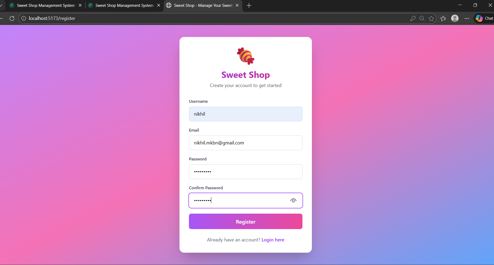
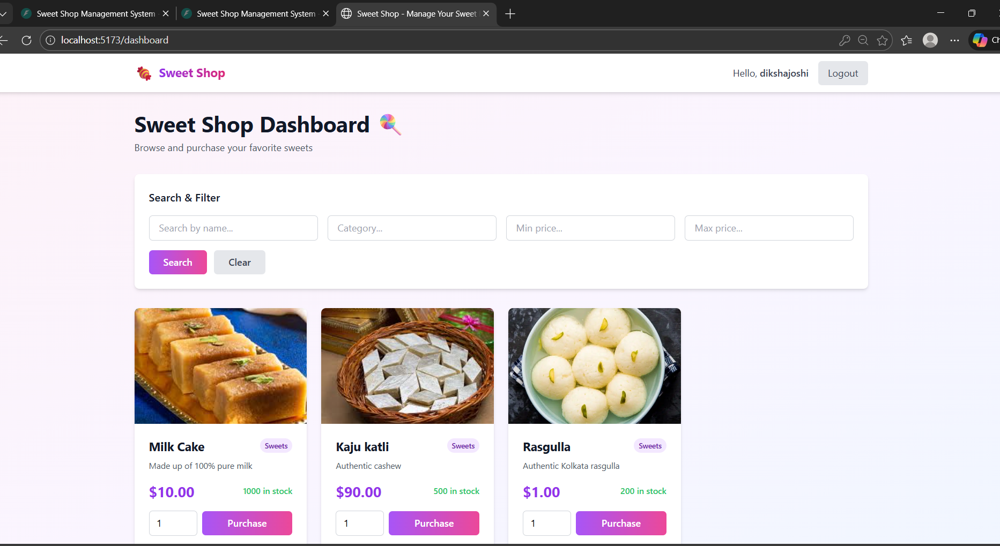

# Sweet Shop Management System

A full-stack web application for managing a sweet shop inventory with user authentication, built using **Test-Driven Development (TDD)** practices.


## 📋 Table of Contents
- [Overview](#overview)
- [Features](#features)
- [Tech Stack](#tech-stack)
- [Setup Instructions](#setup-instructions)
- [Running the Application](#running-the-application)
- [Testing](#testing)
- [API Documentation](#api-documentation)
- [My AI Usage](#my-ai-usage)
- [Project Structure](#project-structure)
- [Screenshots](#screenshots)

---

## 🎯 Overview

This project is a comprehensive Sweet Shop Management System that allows users to:
- Register and authenticate with JWT tokens
- Browse and search available sweets
- Purchase sweets (decreases inventory)
- Admin users can add, update, delete, and restock sweets

The entire backend was built using **Test-Driven Development (TDD)** methodology, with tests written before implementation.

---

## ✨ Features

### Authentication
- ✅ User registration with email validation
- ✅ Secure login with JWT token authentication
- ✅ Password hashing using bcrypt
- ✅ Protected routes requiring authentication
- ✅ Admin-only operations

### Sweets Management
- ✅ Create new sweets (authenticated users)
- ✅ View all available sweets
- ✅ Search sweets by name, category, or price range
- ✅ Update sweet details
- ✅ Delete sweets (admin only)
- ✅ Purchase sweets (decreases quantity)
- ✅ Restock sweets (admin only)

### Frontend
- ✅ Modern, responsive UI
- ✅ User authentication flow
- ✅ Dashboard with sweets display
- ✅ Search and filter functionality
- ✅ Purchase interface
- ✅ Admin panel for inventory management

---

## 🛠️ Tech Stack

### Backend
- **Framework**: FastAPI (Python)
- **Database**: SQLite
- **ORM**: SQLAlchemy
- **Authentication**: JWT (python-jose)
- **Password Hashing**: bcrypt + passlib
- **Validation**: Pydantic v2
- **Testing**: pytest, pytest-cov
- **API Documentation**: Swagger UI (auto-generated)

### Frontend
- **Framework**: React with TypeScript
- **Build Tool**: Vite
- **Styling**: Tailwind CSS
- **State Management**: Zustand
- **HTTP Client**: Axios
- **Routing**: React Router

---

## 🚀 Setup Instructions

### Prerequisites
- Python 3.9+ installed
- Node.js 16+ and npm installed
- Git installed

### Backend Setup

1. **Navigate to backend directory**
   ```bash
   cd backend
   ```

2. **Create and activate virtual environment**
   ```bash
   # Windows
   python -m venv venv
   venv\Scripts\activate

   # macOS/Linux
   python -m venv venv
   source venv/bin/activate
   ```

3. **Install dependencies**
   ```bash
   pip install -r requirements.txt
   ```

4. **Configure environment variables**
   
   Create a `.env` file in the `backend` directory:
   ```env
   DATABASE_URL=sqlite:///./sweet_shop.db
   SECRET_KEY=your-secret-key-here-at-least-32-characters-long-change-this
   ALGORITHM=HS256
   ACCESS_TOKEN_EXPIRE_MINUTES=30
   ```

   **Important**: Generate a secure SECRET_KEY for production:
   ```bash
   python -c "import secrets; print(secrets.token_urlsafe(32))"
   ```

### Frontend Setup

1. **Navigate to frontend directory**
   ```bash
   cd frontend
   ```

2. **Install dependencies**
   ```bash
   npm install
   ```

3. **Configure API endpoint** (if needed)
   
   The frontend is configured to connect to `http://localhost:8000` by default.

---

## ▶️ Running the Application

### Start Backend Server

```bash
cd backend
python run.py
```

The backend will be available at:
- API: http://localhost:8000
- Interactive API Docs: http://localhost:8000/docs
- Alternative Docs: http://localhost:8000/redoc

### Start Frontend Development Server

```bash
cd frontend
npm run dev
```

The frontend will be available at: http://localhost:5173

---

## 🧪 Testing

### Backend Tests

The backend has comprehensive test coverage (96%) with 42 tests covering all endpoints.

**Run all tests:**
```bash
cd backend
pytest tests/ -v
```

**Run with coverage report:**
```bash
pytest tests/ --cov=app --cov-report=term --cov-report=html
```

**View HTML coverage report:**
```bash
# Windows
start htmlcov/index.html

# macOS
open htmlcov/index.html

# Linux
xdg-open htmlcov/index.html
```

### Test Results

```
============================= test session starts =============================
Platform: Windows
Python: 3.13.1
pytest: 9.0.2

Tests Collected: 42
Tests Passed: 42 ✅
Tests Failed: 0
Coverage: 96%
```

**Coverage Breakdown:**
- `app/routers/auth.py` - 100%
- `app/routers/sweets.py` - 100%
- `app/schemas/__init__.py` - 100%
- `app/models/__init__.py` - 100%
- `app/utils/auth.py` - 93%
- **Overall: 96%**

---

## 📚 API Documentation

### Authentication Endpoints

| Method | Endpoint | Description | Auth Required |
|--------|----------|-------------|---------------|
| POST | `/api/auth/register` | Register new user | No |
| POST | `/api/auth/login` | Login and get JWT token | No |
| GET | `/api/auth/me` | Get current user info | Yes |

### Sweets Endpoints

| Method | Endpoint | Description | Auth Required | Admin Only |
|--------|----------|-------------|---------------|------------|
| POST | `/api/sweets` | Create a new sweet | Yes | No |
| GET | `/api/sweets` | Get all sweets | Yes | No |
| GET | `/api/sweets/search` | Search sweets with filters | Yes | No |
| GET | `/api/sweets/{id}` | Get specific sweet | Yes | No |
| PUT | `/api/sweets/{id}` | Update sweet details | Yes | No |
| DELETE | `/api/sweets/{id}` | Delete sweet | Yes | **Yes** |
| POST | `/api/sweets/{id}/purchase` | Purchase sweet | Yes | No |
| POST | `/api/sweets/{id}/restock` | Restock sweet | Yes | **Yes** |

### Example API Calls

**Register a user:**
```bash
curl -X POST "http://localhost:8000/api/auth/register" \
  -H "Content-Type: application/json" \
  -d '{
    "username": "john_doe",
    "email": "john@example.com",
    "password": "secure123"
  }'
```

**Login:**
```bash
curl -X POST "http://localhost:8000/api/auth/login" \
  -H "Content-Type: application/json" \
  -d '{
    "username": "john_doe",
    "password": "secure123"
  }'
```

**Create a sweet (with token):**
```bash
curl -X POST "http://localhost:8000/api/sweets" \
  -H "Authorization: Bearer YOUR_TOKEN_HERE" \
  -H "Content-Type: application/json" \
  -d '{
    "name": "Chocolate Bar",
    "category": "Chocolate",
    "price": 2.50,
    "quantity": 100,
    "description": "Delicious milk chocolate"
  }'
```

---

### Transparency Statement

I estimate that approximately **70% of the initial code** was AI-generated, but **100% was reviewed, tested, and modified by me**. The final codebase represents a collaboration between human judgment and AI assistance, with all critical decisions made by me.

---

## 📁 Project Structure

```
sweet_shop/
├── backend/
│   ├── app/
│   │   ├── __init__.py
│   │   ├── main.py              # FastAPI application
│   │   ├── config.py            # Configuration settings
│   │   ├── database.py          # Database connection
│   │   ├── models/
│   │   │   └── __init__.py      # User & Sweet models
│   │   ├── schemas/
│   │   │   └── __init__.py      # Pydantic schemas
│   │   ├── routers/
│   │   │   ├── __init__.py
│   │   │   ├── auth.py          # Authentication endpoints
│   │   │   └── sweets.py        # Sweets CRUD endpoints
│   │   └── utils/
│   │       ├── __init__.py
│   │       └── auth.py          # Auth utilities (JWT, hashing)
│   ├── tests/
│   │   ├── __init__.py
│   │   ├── conftest.py          # Pytest fixtures
│   │   ├── test_auth.py         # Authentication tests
│   │   └── test_sweets.py       # Sweets CRUD tests
│   ├── .env                     # Environment variables
│   ├── requirements.txt         # Python dependencies
│   ├── pytest.ini               # Pytest configuration
│   └── run.py                   # Server entry point
│
├── frontend/
│   ├── src/
│   │   ├── components/          # React components
│   │   ├── pages/               # Page components
│   │   ├── services/            # API services
│   │   ├── stores/              # State management
│   │   ├── types/               # TypeScript types
│   │   ├── app.tsx              # Main app component
│   │   └── main.tsx             # Entry point
│   ├── public/                  # Static assets
│   ├── index.html
│   ├── package.json
│   ├── tsconfig.json
│   ├── vite.config.ts
│   └── tailwind.config.js
│
└── README.md                    # This file
```

---

## 📸 Screenshots

### User Registration


### Login


### Dashboard


### Admin Panel


### Purchase Sweet


---

## 🎓 Development Methodology

This project was built using **Test-Driven Development (TDD)**:

1. **Red Phase** ✅ - Wrote tests first (they failed initially)
2. **Green Phase** ✅ - Implemented code to make tests pass
3. **Refactor Phase** ✅ - Cleaned up code while maintaining test coverage

All commits follow a clear narrative showing the TDD process.

---

## 📝 License

This project was created as part of a coding kata/assessment.

---

## 👤 Author

Created with ❤️ using Test-Driven Development and AI assistance.

**AI Co-authorship**: This project was developed with significant assistance from Google Gemini AI. See the [My AI Usage](#my-ai-usage) section for detailed transparency about AI involvement.

---

## 🙏 Acknowledgments

- FastAPI documentation and community
- pytest and testing best practices
- Google Gemini for AI assistance
- TDD methodology pioneers
